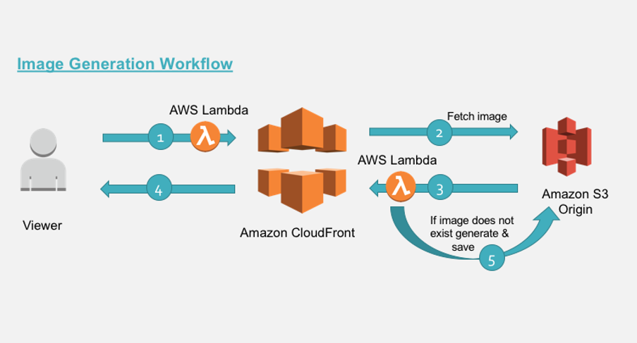

# Serverless CloudFront Image Proxy

Make CloudFront resize images "on the fly" via lambda@edge, cache it and persists it in S3. Utilises [Sharp](http://sharp.dimens.io/en/stable) for image transformations.



Illustration & inspiration from [this blog post](https://aws.amazon.com/blogs/networking-and-content-delivery/resizing-images-with-amazon-cloudfront-lambdaedge-aws-cdn-blog/)

## Package & Deploy

Since this relies on compiled binaries for libvips, the package & deploy is a bit cumbersome.

```
rm -rf node_modules
docker run -v "$PWD":/var/task lambci/lambda:build-nodejs6.10 /bin/bash -c 'npm install -g serverless && npm install && sls package'
sls deploy -p .serverless
```
## Lambda@Edge Gotchas

- Functions have to reside in `us-east-1`
- Node 6.10 only
- No environment variables
- Viewer-* functions are limited to 5 seconds execution and 128 MB RAM [See here](https://docs.aws.amazon.com/AmazonCloudFront/latest/DeveloperGuide/cloudfront-limits.html#limits-lambda-at-edge)
- Response-* functions normal Lambda limits
- CloudFront deployment takes about 20 minutes. Hence, an update of functions takes the same time
- CloudWatch logs appear at the closest option to the edge location of a request

## Still Missing

- Tests! Given we have to wait 20 minutes for a deployment, a "production" failure is quite costly

## Further Ideas

- Add dynamic configuration file to work around the missing environment in lambda@edge
- Make the resizing more resilient (limit to original image dimensions, allow something like `x300` to scale one dimension dynamically)
- Encode dimensions in path to get rid of the `viewer-request` function
- Expose more Sharp features
- On-Demand external image source
  -  e.g. fetch original image from mydomain.com and persist it in S3
- Add Kinsesis stream to aggregate all CloudWatch logs from functions across all edge locations
